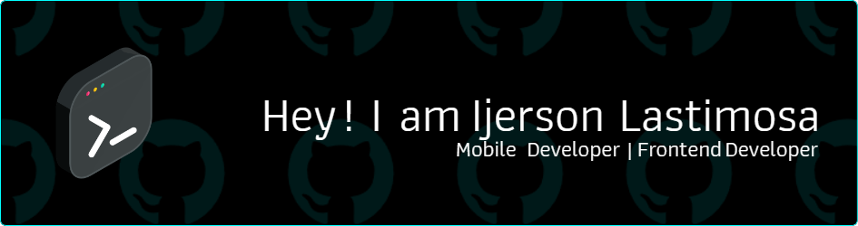

<!-- <h1 align="center">Hi, I am Ijerson Lastimosa Ilalto, developing my ideas.</h1> -->

- 💬 Languages: **JavaScript, TypeScript, Python, HTML/CSS**

- 🙂 Frameworks: **React Native, Expo, Angular, Angular Ionic, Bootstrap**

- 📫 How to reach me: **sonilalto@gmail.com**

- ⚡ Motto/s:
- **"Don't just live a life, build one" - Steve Jobs**
- **"It always seems impossible until it's done" - Nelson Mandela**
- **"The best way to predict the future is to invent it." - Alan Kay**
- **"There's no such thing as can't." - Christopher Reeve**

  <ul align="center">
    
<h2 style="display: inline-block">Languages and Frameworks I'm Familiar 👨🏻‍💻</h2>

  </ul>

<!--tech stack icons--> 

 
 
 
 
 
 
 
 
 
 
 
 
 
 
 
 
 
 
 
 
 
 
 
 

<!-- 

  

 -->

  <ul align="center">
    
<h2 style="display: inline-block">IDE's and Tools I Use 👨🏻‍💻</h2>

  </ul>

<!--tech stack icons-->

  <a href="https://skillicons.dev">
  
  
  
  
  
  
  
  
  
  
  
  
  
  
  
  
  
  
  
  
  
  
  
  
  
  
  
  
  
  
  
  
    <!--  -->
  </a>

  <h4 align="center">LEETCODE stats</h4>
  
  
  <h4 align="center">CODEWARS stats</h4>
  

  

 

<h4>GITHUB stats</h4>
<a href="#">

</a>

  

    

  

<h4 align="center">Visitor's count 👀</h4>

<!-- edit for: https://github.com/sonlast -->